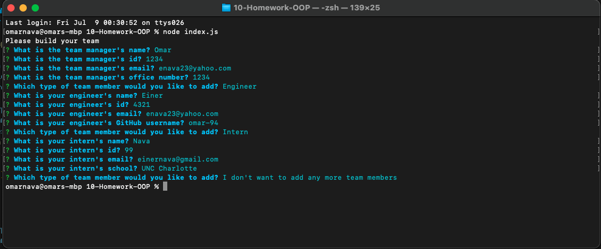
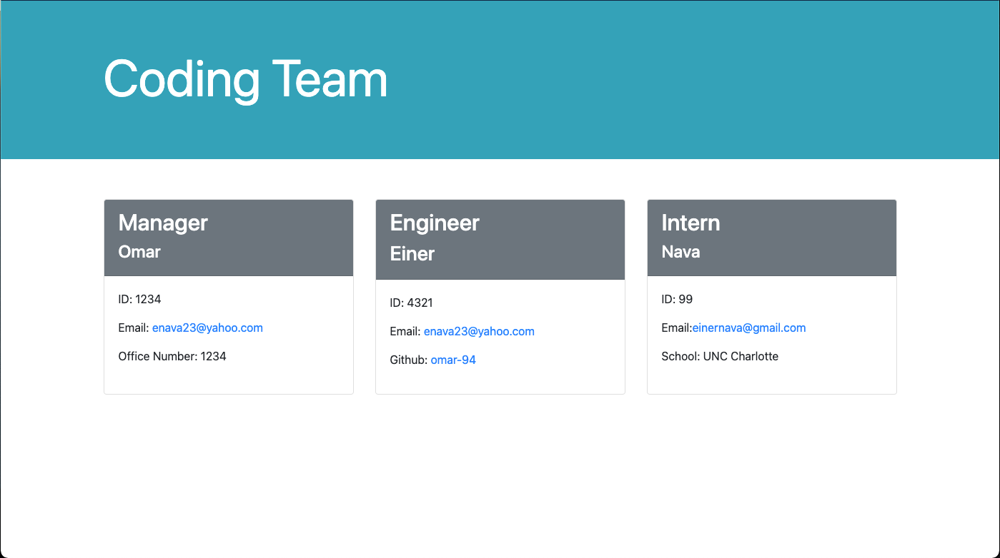

# Team Profile Generator

## Description
Team Profile Generator is a command-line-input application run in Node requesting information about members of a team and generates an HTML file displaying the information. Upon launching application, the user is prompted about information regarding three types of employees. User may continue to add members or quit application. Once members have all been added and user completes the request to finish application, an HTML file is generated to contain all the information provided in a concise page.   

## Links
- Video Walkthrough:  
https://drive.google.com/file/d/1CXRlwcZRkhacO6JjcEUYgKYCwqOcRV4W/view  

- GitHub Repository:  
https://github.com/omar-94/Team-Profile-Generator  

- Generated HTML Code:  
https://github.com/omar-94/Team-Profile-Generator/blob/main/output/team.html  

## Installation
To run application you will need to install **node.js** along with the **Jest** and **Inquirer** packages.

## Technologies
- Node.js
- NPM (Inquirer)
- NPM (Jest)
- Javascript
- HTML

## Contact 
Omar Nava  
enava23@yahoo.com  
https://github.com/omar-94  